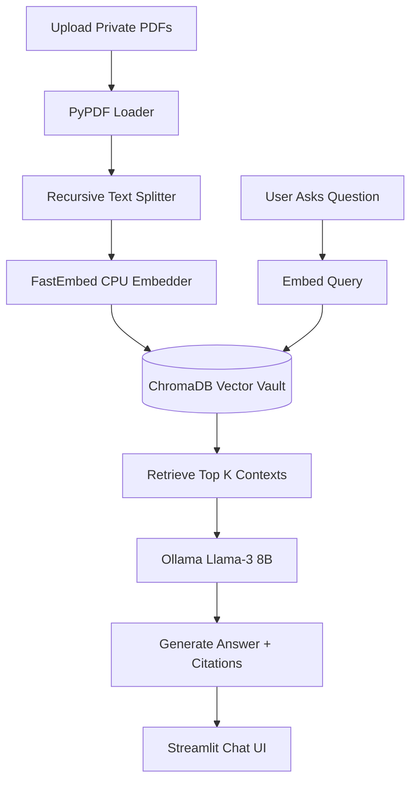

# 🧠 VaultMind: Hyper-Local RAG Intelligence


> VaultMind is a fully offline, privacy-first Retrieval-Augmented Generation (RAG) system. It leverages the computing power of your local GPU (e.g., RTX 2060) to read, index, and answer questions based on your private PDF documents without sending a single byte of data to the cloud.

## ✨ Premium Enterprise Features
- **Zero-Cloud Architecture:** 100% offline. Total privacy for your sensitive study materials, research papers, or corporate documents. (ChromaDB telemetry explicitly blocked).
- **True Conversational Memory:** Implements a Window Buffer Memory (`k=3`) to maintain chat context like ChatGPT, intelligently preventing VRAM Context Window Overflow.
- **Dynamic AI Model Switching:** Seamlessly switch the local LLM brain (Llama-3, Mistral, Gemma, Phi-3) directly from the UI without restarting the server.
- **Advanced Document Parsing:** Uses `pdfplumber` to cleanly extract complex academic layouts, tables, and columns, while rejecting empty/scanned pages to prevent database crashes.
- **Precision Page Citations:** When the AI answers a question, it explicitly tells you which document and which exact page it got the information from.
- **FastEmbed Optimization:** Uses highly optimized `BAAI/bge-small-en-v1.5` embeddings that run instantly on the CPU, saving all your precious VRAM for the LLM.
- **Enterprise Dashboard:** A beautiful, responsive chat interface built with Streamlit featuring one-click Markdown Chat Export.

## 🏗️ System Architecture



## 🚀 Setup & Execution

### 1. Prerequisites
You must have [Ollama](https://ollama.com/) installed and running locally.
```bash
ollama run llama3
```
*(Keep this running in the background. It will use ~4.5GB of your RTX 2060's VRAM).*

### 2. Install VaultMind
```bash
git clone https://github.com/almuzahidseyam/VaultMind-Local-RAG.git
cd VaultMind-Local-RAG
python -m venv venv
source venv/bin/activate
pip install -r requirements.txt
```

### 3. Launch the Matrix
```bash
streamlit run app.py
```

## 🧠 Hardware Optimization
Designed explicitly for systems with 8GB VRAM (e.g., RTX 2060 Super). By offloading the embeddings to the CPU via `fastembed`, we ensure the Llama-3 LLM has the maximum possible memory bandwidth, preventing Out-Of-Memory (OOM) crashes.

## 📝 License
MIT License.
